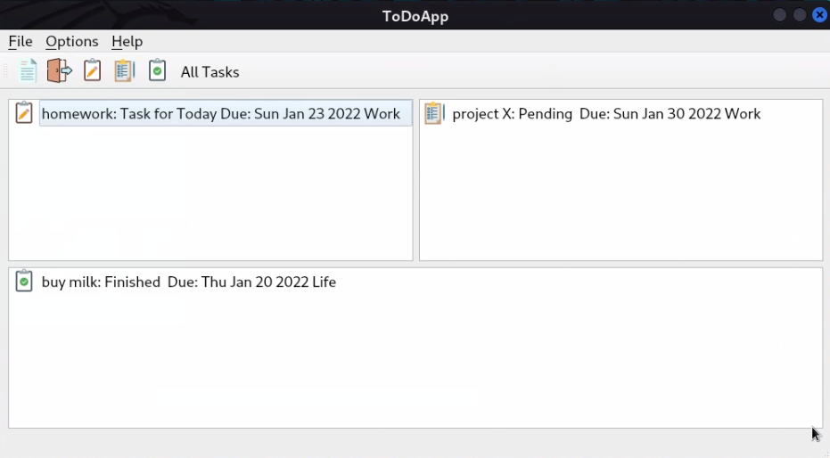
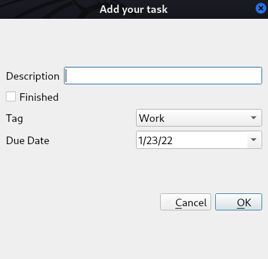
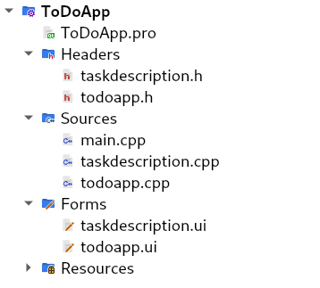

<div id="top"></div>


<!-- PROJECT LOGO -->
<br />
<div align="center">
    
  <h2 align="center">📝ToDo Application using containers</h2>
  <h3 align="center">Create a versatile Todo app using (Item/Model) based containers.</h3>
</div>


<!-- TABLE OF CONTENTS -->

  <summary>Table of Contents</summary>
  <ol>      
      <a href="#about-the-project">About The Project</a>         
      <li><a href="#Overview">Overview</a></li>
      <li><a href="#Use-Cases">Use Cases</a></li> 
      <li><a href="#Defining-a-Task">Defining a Task</a></li> 
      <li><a href="#Item-Based-Model">Item Based Model</a></li> 
      <li><a href="#MVC-Model">MVC Model</a></li>
  </ol>


<!-- ABOUT THE PROJECT -->
# About The Project

<!-- GETTING STARTED -->
## Getting Started

This is an example of how you may give instructions on setting up your project locally.
To get a local copy up and running follow these simple example steps.

1. [**How to install Qt**](https://anassbelcaid.github.io/CS221/qtcreator/)
2. **Clone the repo**
   ```sh
   git clone https://github.com/IlyasKadi/ToDo-Application.git
   ```
 
<p align="right">(<a href="#top">back to top</a>)</p>


📝📧📆🗑️❗⚠️

<!-- Overview -->
# Overview


<div align="center">
    
</div>

> Overview of our application. 


<div align="center">
    
</div>

<p align="right">(<a href="#top">back to top</a>)</p>


<!-- Use-Cases -->
# Use-Cases

Here is a list of **cases** that the user could **perform** with our app:

   1. A user should be able to **close** the application of course.
   2. A Todo application cannot be useful, unless it offers the possibility of **creating new tasks**.    
   3. The View of the main widget should be **split** in **three** areas:   
        1. The first (en persistent) area shows the list of **today** tasks.
        2. The second one is reserved for **pending** task (tasks for the future).
        3. Finally, the third one shows the set of **finished** tasks.
        
   4. Each category must be shown with a **custom** icon.

   5. The user could either `hide/show` the pending and finished views.

   6. Finally, the tasks entered to your application must remains in the app in future use.

   > Meaning, If I create a task and I close the application, next time I opened the application, I should find my tasks and not start from scratch.


<p align="right">(<a href="#top">back to top</a>)</p>


<!-- Defining-a-Task -->
# Defining-a-Task

A `Task` is defined by the following attributes:

   - A `description`: stating the text and goal for the task like (Buying the milk).
   - A `finished` boolean indicating if the task is Finished or due.
   - A `Tag` category to show the class of the task which is reduced to the following values:
       - Work
       - Life
       - Other
   - Finally, a task should have a `DueDate` which stores the **Date** planned for the date.

When the user create a new task, the application must **pop up** a dialog for the user to get those values. Here is an example ( not mandatory, I prefer you create your own) example:


<div align="center">
    
</div>

> An example of a dialog to get a new task.

<p align="right">(<a href="#top">back to top</a>)</p>


<!-- Item-Based-Model -->
# Item-Based-Model

> This is The tree of the project 

<div align="center">
    
</div>


taskdescription.h
```cpp

class TaskDescription : public QDialog
{
    Q_OBJECT

public:

     void setdatabase(QString description, bool finished, QString date, QString tag);
     QSqlDatabase db;
     QString date;
     QString description;
     bool finished;
     QString tag;
     QStringList TT_list ;
     QStringList TBD_list ;
     QStringList FT_list ;
     TaskDescription(QWidget *parent = nullptr);
    ~TaskDescription();
    Ui::TaskDescription *ui;

private slots:
    void on_buttonBox_accepted();

private:
    QString ok;
    void setCurrentDate();
   // Ui::TaskDescription *ui;
};
```

todoapp.h

```cpp
class ToDoApp : public QMainWindow
{
    Q_OBJECT

public:
    void loaddatabase();
    ToDoApp(QWidget *parent = nullptr);
    ~ToDoApp();

private slots:
    void on_action_New_triggered();

    void select_item_today();

    void select_item_finished();

    void select_item_tbd();

    void on_action_Task_Pending_triggered();

    void on_action_Task_finished_triggered();

    void on_actionToday_s_Tasks_triggered();

    void on_actionAll_Tasks_triggered();

private:
    Ui::ToDoApp *ui;
};
```

taskdescription.cpp
```cpp
//Constructor
TaskDescription::TaskDescription(QWidget *parent) :
    QDialog(parent),
    ui(new Ui::TaskDescription)
{
    ui->setupUi(this);

    setCurrentDate();

}

//Destructor
TaskDescription::~TaskDescription()
{
    delete ui;

}

//Setting today's date as default date
void TaskDescription::setCurrentDate()
{
    QDate date = QDate::currentDate();
    ui->dateEdit->setDate(date);
}


//function applied once the Dialog is accepted
void TaskDescription::on_buttonBox_accepted()
{

    const QString format = "ddd MMM d yyyy";

    //Retrieving user_data
    QDate currdate = QDate::currentDate();
    QDate duedate = ui->dateEdit->date();
    QString textdudate = duedate.toString(format);
    QString tag = ui->comboBox->currentText();
    bool isfinished = ui->checkBox->isChecked();
    QString description = ui->lineEdit->text();


    //Filling up tasks_List from user_data ..

    if(isfinished)
        FT_list.append(description+": Finished  Due: " + textdudate + " " + tag);


    else if(duedate==currdate)
        TT_list.append(description+": Task for Today Due: " + textdudate + " " + tag);


    else if(duedate>currdate && !isfinished)
        TBD_list.append(description+": Pending  Due: " + textdudate + " " + tag);

    //settinging up data base and insert new entry from user_data retrieved
    setdatabase( description, isfinished,  textdudate,  tag);


}

void TaskDescription::setdatabase(QString description, bool finished, QString date, QString tag)
{

    // Setting up new file for the DB
    db =QSqlDatabase::addDatabase("QSQLITE");
    db.setDatabaseName("/home/ilyas/Desktop/test_2.sqlite");
    db.open();

    QSqlQuery query(db);

    // Creating the table that will hold all the tasks
    QString create {"CREATE TABLE IF NOT EXISTS task (description VARCHAR(80), finished bool, date date, tag VARCHAR(10))"};
    if(!query.exec(create))
        QMessageBox::critical(this,"info","could not create table");

    //Insert into the Task table values inserted in [setdatabase(des,isF,Date,tag)]
    QString insert {"INSERT INTO task values ('%1','%2','%3','%4')"};
    if(!query.exec(insert.arg(description).arg(finished).arg(date).arg(tag)))
        QMessageBox::critical(this,"info","insert not create table");


}

```


todoapp.cpp

```cpp

//constructor
ToDoApp::ToDoApp(QWidget *parent)
    : QMainWindow(parent)
    , ui(new Ui::ToDoApp)
{
    ui->setupUi(this);
    makeconnections();
    loaddatabase();
}

//Connections for selected_Item aka selected_Task
void ToDoApp:: makeconnections()
{
    connect(ui->to_be_done, &QListWidget::itemActivated , this,  &ToDoApp::select_item_tbd);
    connect(ui->finished, &QListWidget::itemActivated, this,  &ToDoApp::select_item_finished);
    connect(ui->todays_task, &QListWidget::itemActivated, this,  &ToDoApp::select_item_today);
}

//destructor
ToDoApp::~ToDoApp()
{
    delete ui;
}

//NewTAsk Action
void ToDoApp::on_action_New_triggered()
{
    TaskDescription newtask ;
    newtask.exec();

    //Add Items(tasks) to the ListView from their appropriate table :
    
    //TBD_list >> to_be_done
    for(auto e :newtask.TBD_list)
    {
        QString path{"/home/ilyas/Downloads/icons8-and-64.png"};
        QIcon icon(path);
        ui->to_be_done->addItem(new QListWidgetItem(icon,e));
    }
    
    //TT_list >> todays_task
    for(auto e :newtask.TT_list)
    {
        QString path{"/home/ilyas/Downloads/icons8-tâche-48.png"};
        QIcon icon(path);
        ui->todays_task->addItem(new QListWidgetItem(icon,e));
    }
    
    //FT_list >> finished
    for(auto e :newtask.FT_list)
    {
        QString path{"/home/ilyas/Downloads/icons8-tâche-terminée-48.png"};
        QIcon icon(path);
        ui->finished->addItem(new QListWidgetItem(icon,e));
    }


}

//Show Pending_Ts only
void ToDoApp::on_action_Task_Pending_triggered()
{
    ui->to_be_done->show();
    ui->todays_task->hide();
    ui->finished->hide();
}

//Show Finished_TS only
void ToDoApp::on_action_Task_finished_triggered()
{
    ui->todays_task->hide();
    ui->to_be_done->hide();
    ui->finished->show();
}

//Show Today's_Ts only
void ToDoApp::on_actionToday_s_Tasks_triggered()
{
    ui->finished->hide();
    ui->to_be_done->hide();
    ui->todays_task->show();
}

//Show All_Ts 
void ToDoApp::on_actionAll_Tasks_triggered()
{
    ui->finished->show();
    ui->to_be_done->show();
    ui->todays_task->show();
}


void ToDoApp::loaddatabase()
{

    TaskDescription newtask;

    newtask.db =QSqlDatabase::addDatabase("QSQLITE");
    newtask.db.setDatabaseName("/home/ilyas/Desktop/test_2.sqlite");
    newtask.db.open();
       
    const QString format = "ddd MMM d yyyy";
    QDate currdate = QDate::currentDate();
    QString todadate = currdate.toString(format);

    //Query for Today's Ts
    QString sttquery ="SELECT * from task where finished =0 and date ='%1'";
    QSqlQuery tt_query(sttquery.arg(todadate),newtask.db);

    //Query for Pendind_Ts
    QString stbd_query("SELECT * from task where finished =0 and date !='%1' ");
    QSqlQuery tbd_query(stbd_query.arg(todadate),newtask.db);

    //Query for Finished_Ts
    QSqlQuery F_query("SELECT * from task where finished =1",newtask.db);

   //Load data from DB to each task_List
    while(F_query.next())
        newtask.FT_list.append(""+F_query.value(0).toString()+": Finished  Due: " + F_query.value(2).toString() + " " +F_query.value(3).toString());
    
    while(tbd_query.next())
        newtask.TBD_list.append(""+tbd_query.value(0).toString()+": Pending  Due: " + tbd_query.value(2).toString() + " " +tbd_query.value(3).toString());

    while(tt_query.next())
        newtask.TT_list.append(""+tt_query.value(0).toString()+": Task for Today Due: "+ tt_query.value(2).toString() + " " +tt_query.value(3).toString());


    //ADd items(tasks) to the list view from tasks_List :
    
    //TBD_list >> to_be_done
    for(auto e :newtask.TBD_list)
    {
        QString path{"/home/ilyas/Downloads/icons8-and-64.png"};
        QIcon icon(path);
        ui->to_be_done->addItem(new QListWidgetItem(icon,e));
    }
    //todays_task >> TT_list
    for(auto e :newtask.TT_list)
    {
        QString path{"/home/ilyas/Downloads/icons8-tâche-48.png"};
        QIcon icon(path);
        ui->todays_task->addItem(new QListWidgetItem(icon,e));
    }
    
    //FT_list >> finished
    for(auto e :newtask.FT_list)
    {
        QString path{"/home/ilyas/Downloads/icons8-tâche-terminée-48.png"};
        QIcon icon(path);
        ui->finished->addItem(new QListWidgetItem(icon,e));
    }


}

void ToDoApp:: select_item_tbd()
{
    
    TaskDescription newtask;

    const QString format = "ddd MMM d yyyy";
    
    //Retrieving Task_info from selected items
    QString fulldes = ui->to_be_done->currentItem()->data(0).toString();

    QVariant i =fulldes.size();
    int index = fulldes.indexOf(':');

    //Filtering Task_info from selected item(task)
    QString description = fulldes.mid(0,index);
    QString date = fulldes.mid(13+index+3,15);
    QDate Date = QDate::fromString(date,"ddd MMM d yyyy");
    QString tag = fulldes.mid(30+index+2,6);
    
    //Filling up NewTaskEdit from filtered data before EXEC..
    newtask.ui->lineEdit->setText(description);
    newtask.ui->dateEdit->setDate(Date);
    newtask.ui->comboBox->setCurrentText(tag);
    //(no need to change checkbox : finsished it's already unchecked by DEFLT)


    auto reply = newtask.exec();
    if(reply == TaskDescription::Accepted)
    {
        //Filtering Task_info from selected item(task) after accepting TaskEdit dialog..
        QString afdescription = newtask.ui->lineEdit->text();
        QString afdate = newtask.ui->dateEdit->date().toString(format);
        QString aftag=newtask.ui->comboBox->currentText();
        bool finished=newtask.ui->checkBox->isChecked();

        //Delete Query for slected task
        QString sdeleteentry ="DELETE FROM task where description='%1' ";
        QSqlQuery delentry(sdeleteentry.arg(description),newtask.db);
        if(!delentry.exec(sdeleteentry))
            QMessageBox::critical(this,"info","could not delete entry");
     
        //Insert Query for edited task
        QString insert {"INSERT INTO task values ('%1','%2','%3','%4')"};
        QSqlQuery insertentry(newtask.db);
        if(!insertentry.exec(insert.arg(afdescription).arg(finished).arg(afdate).arg(aftag))) 
            QMessageBox::critical(this,"info","could not insert entry");

        //Refreshing ListView
        ui->to_be_done->clear();
        ui->todays_task->clear();
        ui->finished->clear();
        loaddatabase();


    }


}
void ToDoApp:: select_item_finished()
{

    TaskDescription newtask;
    
    const QString format = "ddd MMM d yyyy";
    QString fulldes = ui->finished->currentItem()->data(0).toString();
    int index = fulldes.indexOf(':');

    QString description = fulldes.mid(0,index);
    QString date = fulldes.mid(14+index+3,15);
    QString tag = fulldes.mid(31+index+2,6);
    QDate date = QDate::fromString(date,"ddd MMM d yyyy");
    QString finished = fulldes.mid(index+1,9);

    newtask.ui->lineEdit->setText(finished);
    newtask.ui->dateEdit->setDate(date);
    newtask.ui->comboBox->setCurrentText(tag);
    newtask.ui->checkBox->setChecked(1);


    auto reply = newtask.exec();
    if(reply == TaskDescription::Accepted)
    {

        QString afdescription = newtask.ui->lineEdit->text();
        QString afdate = newtask.ui->dateEdit->date().toString(format);
        QString aftag=newtask.ui->comboBox->currentText();
        bool finished=newtask.ui->checkBox->isChecked();

        QString sdeleteentry ="DELETE FROM task where description='%1' ";
        QSqlQuery delentry(sdeleteentry.arg(description),newtask.db);
        if(!delentry.exec(sdeleteentry))
            QMessageBox::critical(this,"info","could not delete entry");

        QString insert {"INSERT INTO task values ('%1','%2','%3','%4')"};
        QSqlQuery insertentry(newtask.db);        
        if(!insertentry.exec(insert.arg(afdescription).arg(finished).arg(afdate).arg(aftag)))
            QMessageBox::critical(this,"info","could not insert entry");
            
            
        ui->to_be_done->clear();
        ui->todays_task->clear();
        ui->finished->clear();
        loaddatabase();
        
    }


}
void ToDoApp:: select_item_today()
{
    TaskDescription newtask;

    const QString format = "ddd MMM d yyyy";
    QString fulldes = ui->todays_task->currentItem()->data(0).toString();
    int index = fulldes.indexOf(':');
    QString description = fulldes.mid(0,index);
    QString date = fulldes.mid(19+index+3,15);
    QString tag = fulldes.mid(36+index+2,6);

    newtask.ui->lineEdit->setText(description);
    newtask.ui->comboBox->setCurrentText(tag);
    //(no need to change checkbox : finsished it's already unchecked by DEFLT)
    //(no need to change date : Today's date is the date set by DEFLT)

    auto reply = newtask.exec();
    if(reply == TaskDescription::Accepted)
    {
        QString afdescription = newtask.ui->lineEdit->text();
        QString afdate = newtask.ui->dateEdit->date().toString(format);
        QString aftag=newtask.ui->comboBox->currentText();
        bool finished=newtask.ui->checkBox->isChecked();

        QString sdeleteentry ="DELETE FROM task where description='%1' ";
        QSqlQuery delentry(sdeleteentry.arg(description),newtask.db);
        if(!delentry.exec(sdeleteentry))
            QMessageBox::critical(this,"info","could not delete entry");


        QString insert {"INSERT INTO task values ('%1','%2','%3','%4')"};
        QSqlQuery insertentry(newtask.db);        
        if(!insertentry.exec(insert.arg(afdescription).arg(finished).arg(afdate).arg(aftag)))
            QMessageBox::critical(this,"info","could not insert entry");
         
         
         ui->to_be_done->clear();
         ui->todays_task->clear();
         ui->finished->clear();
         loaddatabase();

    }

}
```

<p align="right">(<a href="#top">back to top</a>)</p>


<!-- MVC-Model -->
# MVC-Model


<p align="right">(<a href="#top">back to top</a>)</p>


 
-------------------------------------------------------------------------------------------------------------------------------------------------------------------
 Our Team     : [AIT EL KADI Ilyas](https://github.com/IlyasKadi) - [AZIZ Oussama](https://github.com/ATAMAN0)  
 
   Project Link : [ToDo-Application](https://github.com/IlyasKadi/ToDo-Application)   
 
  > Encadré par  : [Mr.BELCAID-Anass](https://anassbelcaid.github.io)  
                                                                                             
<p align="right">(<a href="#top">back to top</a>)</p>
